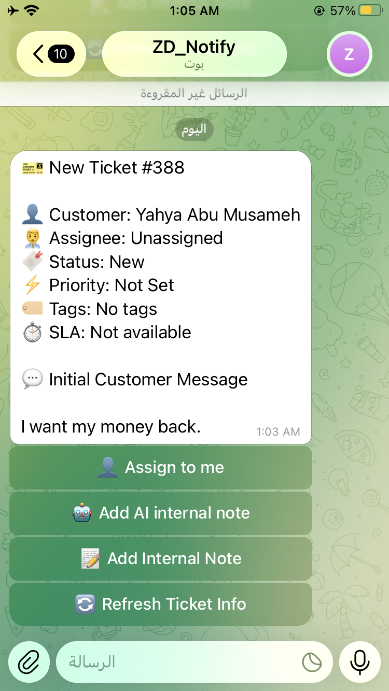
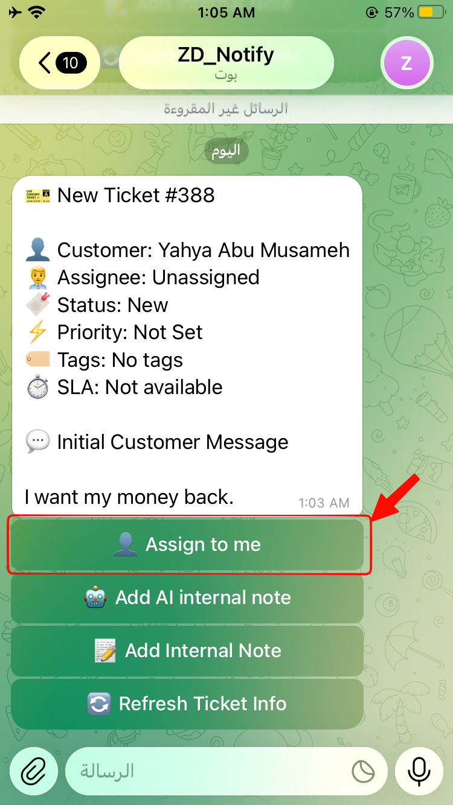
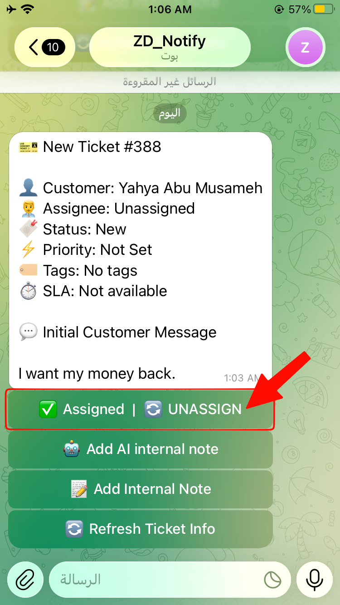

<h1 align="center">Custom Telegram × Zendesk Integration</h1>

## 📌 Overview

This project is a CRM automation system that extends Zendesk functionality by integrating it with Telegram and AI-powered analysis.

It enables customer support operations to be managed directly from Telegram, including ticket updates, assignments, internal notes, and SLA tracking, without requiring direct access to the Zendesk platform.

The system also integrates AI capabilities to analyze ticket content, generate summaries, classify issues, and suggest responses to improve support efficiency and decision-making.

## 🚨 Problem Statement

Modern customer support teams rely heavily on CRM platforms like Zendesk, which require agents to constantly switch between systems to manage tickets, update statuses, and communicate with teams.

This creates inefficiencies when agents are away from their desks or when quick actions are needed without full platform access. It also slows down response time and reduces operational flexibility in time-sensitive support scenarios.

Additionally, support teams often lack real-time AI assistance for understanding ticket context, classifying issues, and generating quick response suggestions directly within their workflow.

## 💡 Solution

This project solves these challenges by building an external CRM layer that connects Telegram, Zendesk, and AI services into a unified workflow.

It enables customer support agents to interact with Zendesk tickets directly through Telegram, allowing them to perform essential actions such as viewing tickets, assigning tasks, and adding internal notes in real time.

A FastAPI backend built in Python acts as the core integration layer between Telegram and Zendesk APIs, handling authentication, request routing, and data synchronization.

To further enhance support operations, AI-powered analysis is integrated to automatically process ticket content, generate summaries, classify issue types, determine priority levels, and suggest professional response drafts.

## ⚙️ Tech Stack

**Backend**
- Python
- FastAPI

**CRM Platform**
- Zendesk API

**Messaging**
- Telegram Bot API

**AI Integration**
- Gemini AI

**Tools**
- Postman
- Git & GitHub
- JSON

## 🚀 Features

- Manage Zendesk tickets directly from Telegram.
- Assign and update tickets in real time.
- View ticket details and SLA information.
- Add internal notes and notify team members.
- AI-powered ticket analysis (summary, classification, priority, response suggestion).
- Real-time synchronization between Telegram and Zendesk.

## 🔄 API Flow

1. User interacts with Telegram bot.
2. Request is sent to FastAPI backend.
3. Backend processes request and communicates with Zendesk API.
4. AI processing is triggered if needed via Gemini AI.
5. Response is returned to Telegram.
6. Updates are synced back to Zendesk in real time.

## 🧠 AI Integration

Gemini AI is used to enhance ticket processing by:

- Summarizing ticket content.
- Classifying issue types.
- Determining priority levels.
- Generating suggested responses for support agents.

## 🧪 How It Works

1. User sends command via Telegram.
2. FastAPI processes request.
3. Zendesk API retrieves or updates ticket data.
4. AI analyzes ticket content if required.
5. Response is sent back to Telegram.
6. Zendesk is updated in real time.

## 📸 Screenshots

- Telegram ticket management interface.

   

  
     &nbsp;&nbsp;&nbsp;&nbsp;
  
     &nbsp;&nbsp;&nbsp;&nbsp;
  
  

  
- Zendesk real-time ticket updates.
- AI-generated ticket analysis.
- Internal notes and notifications flow.
- SLA tracking view from Telegram.

## ⚠️ Challenges & Solutions

- **Multi-action control:** Unified Telegram command system.
- **AI unstructured data:** Structured prompts for consistent output.
- **API reliability:** Testing and validation using Postman.

## 📈 Impact

This project improves CRM efficiency by reducing the need to switch between systems and enabling faster support operations through Telegram.

It enhances decision-making using AI-generated insights and improves response consistency while maintaining full synchronization with Zendesk.

## 🔮 Future Improvements

- Improve API response time and system efficiency.
- Expand automation coverage for more Zendesk actions.
